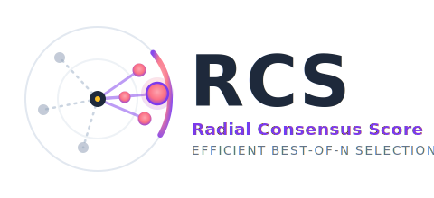

<div align="center">

  <h1><b> RCS: Radial Consensus Score </b></h1>
  <p><i>Efficient Best-of-N — pick the most consistent answer, not the luckiest one.</i></p>
</div>

<div align="center">

[](https://arxiv.org/pdf/2604.12196)
[](https://www.python.org/)
[](https://github.com/huggingface/transformers)
[](https://github.com/vllm-project/vllm)

</div>

<div align="center">

🚀 [**Getting Started**](#install) **|**
🔧 [**Usage**](#usage) **|**
🧪 [**Reproducing Results**](#reproduce) **|**
🎯 [**Benchmarks**](#bench) **|**
📂 [**Project Structure**](#structure)

</div>

**RCS** is the reference implementation of **Radial Consensus Score**, a verifier-free
Best-of-N selector that picks the candidate answer closest to the *consensus center* of
a sampled response cloud — *no auxiliary reward model, no extra LLM call*.

Self-consistency wins on math but collapses on free-form QA, where two correct answers
are rarely the same string. RCS replaces the discrete vote with a **continuous
Fréchet-mean distance** in embedding space:

- **Project** every sampled response into a sentence embedding.
- **Aggregate** them into a single center — uniform, frequency-weighted, probability-weighted,
  cosine-similarity-weighted, or a robust medoid variant.
- **Select** the response with the smallest distance to that center.

RCS is a strict generalization of majority voting (recovering it on discrete-answer tasks)
and stays well-defined on free-form generation, where majority vote is undefined.

📜 For method details and full results, see the paper:
**Efficient Best-of-N with Radial Consensus Score** (preprint coming soon).

---

## <a name="install"></a> 🚀 Installation

#### ⏬ Environment Setup

```bash
git clone https://github.com/manhitv/RCS.git RCS
cd RCS

conda create -n rcs python=3.10 -y
conda activate rcs
pip install -r requirements.txt
```

> 📌 `requirements.txt` is a `pip freeze` of the working `vllm` conda environment,
> plus two extras (`evaluate`, `google-genai`) the code imports directly. If you hit a
> CUDA-mismatch on `torch` / `vllm`, reinstall those two against your local CUDA build.

> 📌 Before running anything, update the paths in [src/config.py](src/config.py) to match
> your local layout (`hf_cache_dir`, `data_dir`, `output_dir`).

> 📌 **Black-box experiments (Cohere / Gemini)?** Export your API key:
> ```bash
> export COHERE_API_KEY="your_cohere_api_key_here"
> export GEMINI_API_KEY="your_gemini_api_key_here"
> ```

---

## <a name="usage"></a> 🔧 Usage

The pipeline is two stages: **generation** (sample `N` candidates per question once) then
**ranking** (compute every Best-of-N metric in a single pass over the cached samples).

#### 1️⃣ Generation

```bash
python -m src.generation \
    --model qwen2.5-3b --dataset gpqa \
    --n_samples 10 --fraction_of_data_to_use 1.0 \
    --max_new_tokens 512 --seed 42
```

Saves a pickle of sampled responses + token log-probabilities to
`$output_dir/<dataset>_<model>_N=..._S=...__generation.pkl`. Re-running the same command
loads the cache instead of regenerating.

#### 2️⃣ Best-of-N ranking

```bash
python -m src.ranking \
    --model qwen2.5-3b --dataset gpqa \
    --n_samples 10 --fraction_of_data_to_use 1.0 \
    --self_certainty --modex --include_oracle --seed 42
```

A single run computes **every** metric below and appends one row to
`results/ranking_logs.tsv`:

| Family | Methods |
|--------|---------|
| Likelihood       | `nll`, `avg_nll` |
| RDS (Fréchet)    | `rds_base`, `rds_freq`, `rds_prob` |
| RDS (Medoid)     | `rds_medoid`, `rds_medoid_freq`, `rds_medoid_prob` |
| RDS (Cosine)     | `scw`, `rds_cosine` |
| RDS (Raw, math)  | `rds_raw_*` (with `--raw_answers`) |
| Voting / Baseline| `majority`, `greedy` |
| Optional         | `self_certainty`, `modex`, `oracle` |

#### Key flags

| Flag | Description |
|------|-------------|
| `--model`                  | Model key (see [Benchmarks](#bench)) |
| `--dataset`                | Benchmark name (`gpqa`, `gsm8k`, ...) |
| `--n_samples`              | Number of generations per question |
| `--embed_model`            | Sentence-transformer for RDS (`all-MiniLM-L6-v2` by default) |
| `--self_certainty`         | Add the self-certainty + power-vote baseline (loads HF model) |
| `--modex`                  | Add the ModeX spectral-graph-cut baseline |
| `--include_oracle`         | Add oracle upper bound (slow on free-form QA) |
| `--ignore_null`            | Drop samples whose extracted answer is null/empty |
| `--raw_answers`            | RDS on raw numeric answers (math datasets only) |
| `--full_answers`           | Embed full reasoning traces instead of extracted answers |
| `--threshold`              | ROUGE threshold for short-form QA (default `0.3`) |
| `--eval_method`            | `rougeL` (default) or `llm_eval` |
| `--api_type`               | `cohere` or `gemini` (used by `llm_eval` and black-box) |

#### ⚡ Quick validation

```bash
bash run.sh
```

#### 📒 Outputs

After each ranking run:
- **Accuracy table** is appended to `results/ranking_logs.tsv` (one row per run, one
  column per metric).
- Black-box runs (`src/blackbox.py`) write per-sample predictions to
  `results/<client>_<dataset>_<N>_<T>_<top_p>_<max_tokens>.csv`.
- Self-certainty scores are cached at
  `$output_dir/<dataset>_<model>_..._self_certainty.pkl` so the heavy HF pass only runs once.

---

## <a name="reproduce"></a> 🧪 Reproducing Paper Results

Every experiment in the paper is driven by `src/generation.py` + `src/ranking.py`. The
`bashfiles/` directory bundles the full sweeps; representative scripts are shown below.

| Script | Purpose |
|--------|---------|
| `bashfiles/rds_ranking.sh`     | Main accuracy table across datasets and models |
| `bashfiles/rds_blackbox.sh`    | Cohere black-box sampling for AIME / GPQA / HLE / BBH |
| `bashfiles/rds_ablation.sh`    | RDS variant ablation (center, weighting, raw vs. embedding) |
| `bashfiles/rcs_embed_s*.sh`    | Embedding-model sensitivity (`all-MiniLM`, `mpnet`, `roberta-large`) |
| `bashfiles/rcs_threshold*.sh`  | Threshold sweeps for short-form QA |
| `bashfiles/ranking_s*.sh`      | Per-seed reruns of the main table |
| `run.sh`                        | Quick end-to-end smoke test |

---

## <a name="bench"></a> 🎯 Benchmarks

#### ☝️ Tested Models

| Model key | Hugging Face / API |
|-----------|--------------------|
| `qwen2.5-1.5b` / `3b` / `7b` / `14b`  | `Qwen/Qwen2.5-{N}B-Instruct` |
| `llama3.1-8b` / `llama3.2-1b` / `3b`  | `meta-llama/Llama-3.{x}-{N}B-Instruct` |
| `falcon3-1b` / `7b` / `10b`           | `tiiuae/falcon3-{N}b-instruct` |
| `gemma3-1b` / `4b` / `12b`            | `google/gemma-3-{N}b-it` |
| `phi3.5-3b` / `phi4-3b`               | `microsoft/Phi-{x}-mini-instruct` |
| `oss-20b`                             | `openai/gpt-oss-20b` |
| `command-a-03-2025`                   | Cohere API (black-box, via `src/blackbox.py`) |

Full list lives in `MODEL_PATH_DICT` in [src/utils.py](src/utils.py).

#### ✌️ Supported Benchmarks

| `--dataset` | Type | Notes |
|-------------|------|-------|
| `gsm8k`         | Math (grade-school)        | Numeric answer in `{...}` |
| `arith` / `arith_long` | Synthetic arithmetic | Exact-match / 1-decimal rounding |
| `svamp`         | Math word problems         | Exact match |
| `gpqa`          | Graduate-level science QA  | Free-form, ROUGE / LLM-judge |
| `formal_logic`  | MMLU formal logic          | MCQ |
| `pro_med`       | MMLU professional medicine | MCQ |
| `mmlu_pro`      | MMLU-Pro                   | 10-way MCQ |
| `crux_eval`     | Code-output prediction     | JSON-formatted answer |
| `sciq` / `nq`   | Short-form QA              | ROUGE w/ threshold |
| `trivia_qa` / `truthful_qa` / `coqa` | Long-form QA | ROUGE / LLM-judge |
| `bbh_date` / `bbh_nav` / `aime25` / `hle` | Black-box only (`src/blackbox.py`) | Cohere API |

Datasets are loaded automatically by `parse_dataset` / `get_blackbox_dataset` in
`src/utils.py` — just pass the name to `--dataset`.

---

## <a name="structure"></a> 📂 Project Structure

```text
RCS/
├── assets/             # Logo and figures
├── bashfiles/          # Reproduction scripts for every paper experiment
├── results/            # TSV/CSV summaries (created on first run)
├── paper/              # Paper sources
├── environment.yaml    # Conda environment spec
├── run.sh              # Quick end-to-end smoke test
└── src/
    ├── generation.py   # Stage 1: sample N candidates per question (vLLM)
    ├── ranking.py      # Stage 2: compute every Best-of-N metric in one pass
    ├── blackbox.py     # Black-box (Cohere) sampling pipeline
    ├── utils.py        # Dataset loaders, metrics, baselines, prompt suffixes
    ├── config.py       # Local paths (HF cache, data, output)
    └── api_key.py      # Cohere / Gemini API keys (gitignored)
```

> 📁 `results/` and the `$output_dir` configured in `src/config.py` are **created
> automatically** on the first run — you do not need to make them yourself.

---

## Acknowledgements

* [vLLM](https://github.com/vllm-project/vllm) — fast batched inference
* [sentence-transformers](https://www.sbert.net/) — embedding backbone for RDS
* [Cohere](https://cohere.com/) — black-box API evaluation
* Self-certainty baseline ported from
  [backprop07/Self-Certainty](https://github.com/backprop07/Self-Certainty)

This project is released under the [MIT License](LICENSE).
