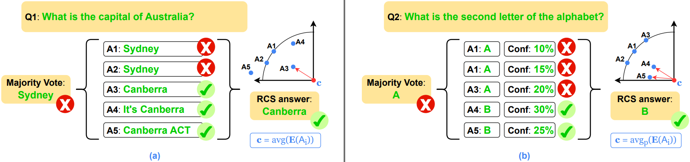

<div align="center">

  <h1><b> RCS: Radial Consensus Score </b></h1>
  <p><i>Efficient Best-of-N — pick the most consistent answer, not the luckiest one.</i></p>
</div>

<div align="center">

[](https://arxiv.org/pdf/2604.12196)
[](https://www.python.org/)
[](https://github.com/vllm-project/vllm)

</div>

<div align="center">

🚀 [**Install**](#install) **|**
🔧 [**Usage**](#usage) **|**
🧪 [**Reproducing Results**](#reproduce) **|**
🎯 [**Benchmarks**](#bench) **|**
📂 [**Project Structure**](#structure)

</div>

**RCS** is the reference implementation of **Radial Consensus Score**, a verifier-free
Best-of-N selector that picks the candidate answer closest to the *consensus center* of a
sampled response cloud — *no auxiliary reward model, no extra LLM call*.

Self-consistency wins on math but collapses on free-form QA, where two correct answers
are rarely the same string. RCS replaces the discrete vote with a **continuous
Fréchet-mean distance** in embedding space: project responses, aggregate them into one
center (uniform, frequency-, probability-, or cosine-similarity-weighted, or a robust
medoid), and pick the closest sample. RCS recovers majority vote on discrete tasks and
stays well-defined on free-form generation.

<div align="center">

</div>

📜 **Paper:** [*Efficient Best-of-N with Radial Consensus Score*](https://arxiv.org/pdf/2604.12196).

> If you find this repository helpful for your work, please consider citing as follows:
>
> ```LaTeX
> @article{nguyen2026beyond,
>  title={Beyond Majority Voting: Efficient Best-Of-N with Radial Consensus Score},
>  author={Nguyen, Manh and Gupta, Sunil and Le, Hung},
>  journal={arXiv preprint arXiv:2604.12196},
>  year={2026}
> }
> ```
---

## <a name="install"></a> 🚀 Installation

```bash
git clone https://github.com/manhitv/RCS.git RCS
cd RCS

conda create -n rcs python=3.10 -y
conda activate rcs
pip install -r requirements.txt
```

> 📌 Update the paths in [src/config.py](src/config.py) before the first run
> (`hf_cache_dir`, `data_dir`, `output_dir`).
>
> 📌 Black-box experiments need `export COHERE_API_KEY="..."`.

---

## <a name="usage"></a> 🔧 Usage

Two stages: **generation** samples `N` candidates per question (cached on disk);
**ranking** computes every Best-of-N metric in a single pass over the cached samples.

```bash
# Stage 1 — sample N candidates
python -m src.generation --model qwen2.5-3b --dataset gpqa \
    --n_samples 10 --fraction_of_data_to_use 1.0 --seed 42

# Stage 2 — compute every metric, append one row to results/ranking_logs.tsv
python -m src.ranking --model qwen2.5-3b --dataset gpqa \
    --n_samples 10 --fraction_of_data_to_use 1.0 \
    --self_certainty --modex --include_oracle --seed 42
```

A single ranking run emits all of: `nll`, `avg_nll`, `rds_base`, `rds_freq`, `rds_prob`,
`rds_medoid{,_freq,_prob}`, `scw`, `rds_cosine`, `majority`, `greedy`, and (optionally)
`self_certainty`, `modex`, `oracle`, `rds_raw_*`.

#### Key flags

| Flag | Description |
|------|-------------|
| `--model` / `--dataset` | Model key and benchmark name (see [Benchmarks](#bench)) |
| `--n_samples`           | Number of generations per question |
| `--embed_model`         | Sentence-transformer for RDS (default `all-MiniLM-L6-v2`) |
| `--self_certainty`      | Add the self-certainty (CE) baseline (loads HF model) |
| `--modex`               | Add the ModeX (spectral graph-cut) baseline |
| `--include_oracle`      | Include oracle upper bound (slow on free-form QA) |
| `--ignore_null`         | Drop samples whose extracted answer is null/empty |
| `--raw_answers`         | RDS on raw numeric answers (math datasets only) |
| `--full_answers`        | Embed full reasoning traces instead of final answers |
| `--threshold`           | ROUGE threshold for short-form QA (default `0.3`) |
| `--eval_method`         | `rougeL` (default) or `llm_eval` |

#### ⚡ Quick validation

```bash
bash scripts/validate.sh
```

---

## <a name="reproduce"></a> 🧪 Reproducing Paper Results

All experiments are driven by `src/generation.py` + `src/ranking.py`. The `scripts/`
directory bundles the full sweeps; all main results are averaged over **seeds `42 44 46`**.

| Script | Paper result |
|--------|--------------|
| `scripts/run_main_table.sh`  | Table 1 — main accuracy (5 models × 5 benchmarks, `N=10`) |
| `scripts/run_scaling.sh`     | Figure — budget scaling `N ∈ {5, 10, 20, 40}` |
| `scripts/run_blackbox.sh`    | Table 4a — Cohere black-box on GPQA / MMLU-Pro / BBH |
| `scripts/run_ablations.sh`   | Embedding model, ROUGE threshold, full-trajectory, clean-answer |
| `scripts/validate.sh`        | Quick end-to-end smoke test |

---

## <a name="bench"></a> 🎯 Benchmarks

#### ☝️ Tested Models

| Model key | Hugging Face / API |
|-----------|--------------------|
| `qwen2.5-1.5b` / `3b` / `7b` / `14b`  | `Qwen/Qwen2.5-{N}B-Instruct` |
| `llama3.1-8b` / `llama3.2-1b` / `3b`  | `meta-llama/Llama-3.{x}-{N}B-Instruct` |
| `falcon3-1b` / `7b` / `10b`           | `tiiuae/falcon3-{N}b-instruct` |
| `gemma2-9b` / `gemma3-{1b,4b,12b}`    | `google/gemma-{2,3}-{N}b-it` |
| `command-a-03-2025`                   | Cohere API (black-box, via `src/blackbox.py`) |

Full table: `MODEL_PATH_DICT` in [src/utils.py](src/utils.py).

#### ✌️ Supported Benchmarks

| `--dataset` | Task | Notes |
|-------------|------|-------|
| `gsm8k` / `arith` / `arith_long` / `svamp` | Math reasoning | Exact-match / 1-decimal rounding |
| `gpqa` / `sciq` / `nq`                    | Short-form QA  | ROUGE w/ threshold |
| `formal_logic` / `pro_med` / `mmlu_pro`   | MCQ (MMLU / MMLU-Pro) | Exact match on `(X)` |
| `crux_eval`                                | Code-output prediction | JSON answer |
| `trivia_qa` / `truthful_qa` / `coqa`      | Long-form QA   | ROUGE / LLM-judge |
| `bbh_date` / `bbh_nav` / `aime25` / `hle` | Black-box only | Cohere API |

Datasets are loaded automatically by `parse_dataset` / `get_blackbox_dataset` in
[src/utils.py](src/utils.py) — just pass the name to `--dataset`.

---

## <a name="structure"></a> 📂 Project Structure

```text
RCS/
├── scripts/            # Reproduction scripts for every paper experiment
│   ├── validate.sh
│   ├── run_main_table.sh
│   ├── run_scaling.sh
│   ├── run_blackbox.sh
│   └── run_ablations.sh
├── results/            # TSV / CSV summaries (created on first run)
├── paper/              # Paper sources
└── src/
    ├── generation.py   # Stage 1: sample N candidates per question (vLLM)
    ├── ranking.py      # Stage 2: compute every Best-of-N metric in one pass
    ├── blackbox.py     # Black-box (Cohere) sampling pipeline
    ├── utils.py        # Dataset loaders, metrics, baselines, prompt suffixes
    ├── config.py       # Local paths (HF cache, data, output)
    └── api_key.py      # Cohere / Gemini API keys (gitignored)
```

> 📁 `results/` and the `$output_dir` configured in `src/config.py` are **created
> automatically** on the first run.

---

## Acknowledgements

* [vLLM](https://github.com/vllm-project/vllm) — fast batched inference
* [sentence-transformers](https://www.sbert.net/) — embedding backbone for RDS
* [Cohere](https://cohere.com/) — black-box API evaluation
* Self-certainty baseline ported from
  [backprop07/Self-Certainty](https://github.com/backprop07/Self-Certainty)

This project is released under the [MIT License](LICENSE).
